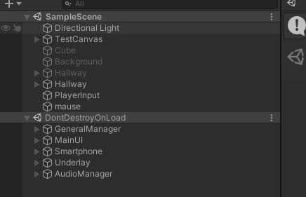
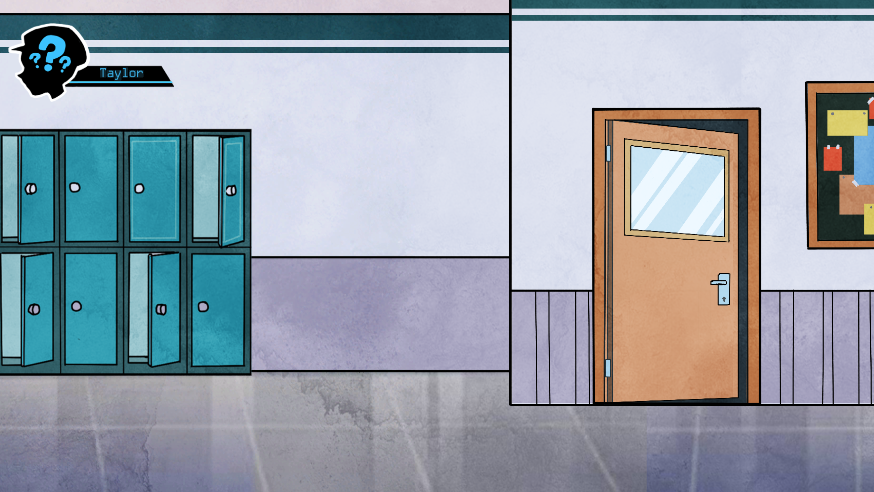
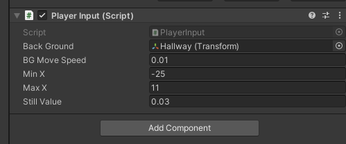
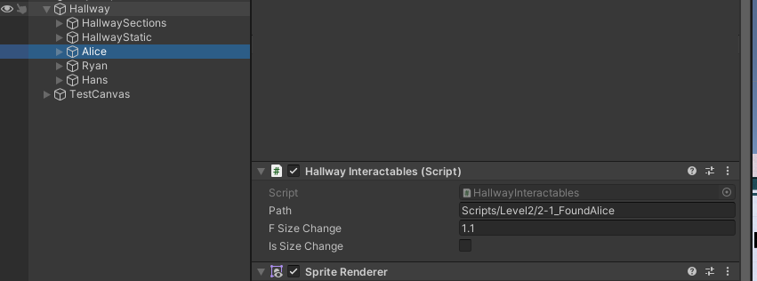
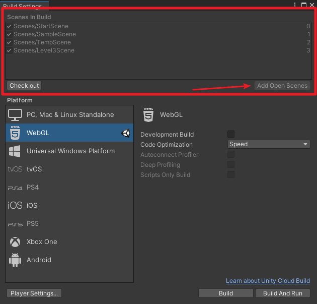
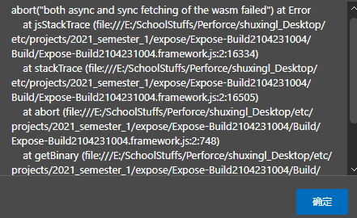
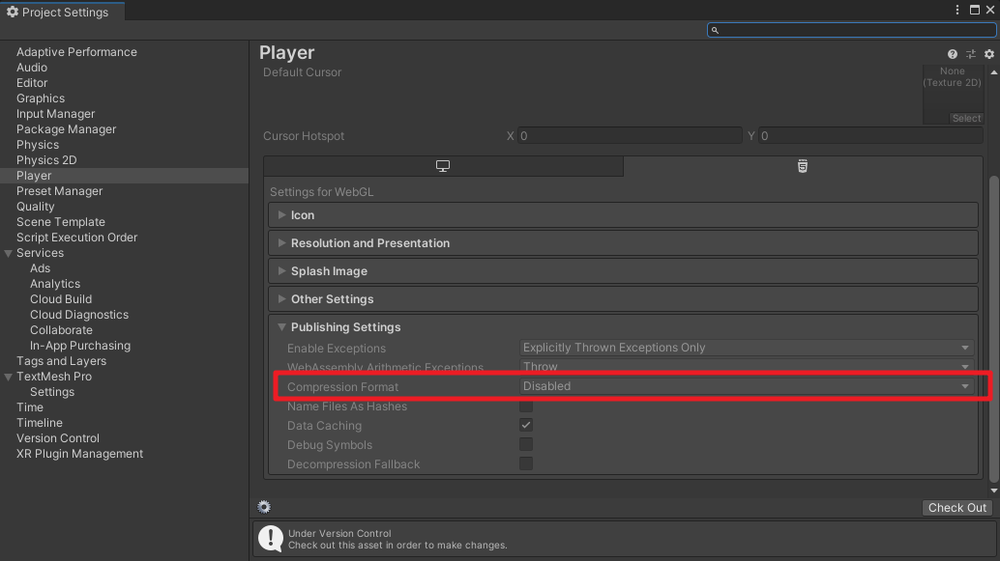
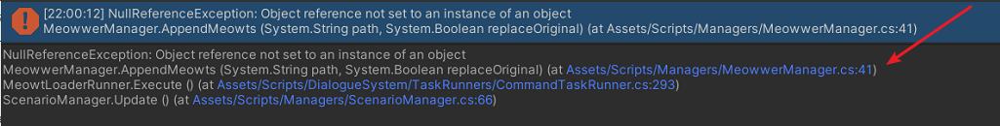
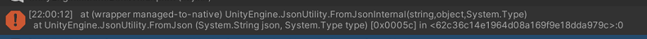

# Putting Everything Together
## 0. Table of Contents

- [Putting Everything Together](#putting-everything-together)
  * [0. Table of Contents](#0-table-of-contents)
  * [1. Creating New Scenes](#1-creating-new-scenes)
    + [1.1. Understanding the Scene Structure](#11-understanding-the-scene-structure)
    + [1.2. Understanding the Scene Structure](#12-understanding-the-scene-structure)
      - [1.2.1. PlayerInput](#121-playerinput)
      - [1.2.2. Hallway](#122-hallway)
      - [1.2.3. TestCanvas](#123-testcanvas)
  * [2. Build Settings](#2-build-settings)
    + [2.1. Adding Scenes to Build settings](#21-adding-scenes-to-build-settings)
    + [2.2. Building the Project](#22-building-the-project)
  * [3. Appendix](#3-appendix)
    + [3.1. The Project Doesn't Run! Help!](#31-the-project-doesn-t-run--help-)
      - [3.1.1. This Page Says: ...](#311-this-page-says--)
      - [3.1.2. Stuck at 80%](#312-stuck-at-80-)
      - [3.1.3. Game is Not Advancing](#313-game-is-not-advancing)
        * [3.1.3.1. How the Hell Do I Understand an Error?](#3131-how-the-hell-do-i-understand-an-error-)

<small><i><a href='http://ecotrust-canada.github.io/markdown-toc/'>Table of contents generated with markdown-toc</a></i></small>

## 1. Creating New Scenes

### 1.1. Understanding the Scene Structure
First, open up the scene `SampleScene`. Hit on run, and you should see something like this.
Expand `DontDestroyOnLoad` and you will see a similar structure down below:

Anything that is under `DontDestroyOnLoad` will persist, even if the scene changes. These items should only be included in the landing scene - in this case, it's the `SampleScene`. If you include these in other scenes, when the scene changes, they fight each other and one of them - which nobody knows which one, will get killed.

 As for anything else that is not under `DontDestroyOnLoad`, you need to include them in each scene, if you were to create a new scene.

### 1.2. Understanding the Scene Structure
To create a new scene, simply copy and paste and edit on `TempScene`.
As we mentioned before, you should only include things that are not under `DontDestroyOnLoad`. Anything under it will be carried over when a new scene loads.

#### 1.2.1. PlayerInput
In the current settings, hallway is, well, the hallway that the players can drag on. The dragging of the hallway is controlled by `PlayerInput` in the scene. It includes configs such as dragging speed, or sensitivity to a click, and the boundaries of the hallway where the players cannot drag beyond.

 - `Back Ground`: The background that you can drag on
 - `BG Move Speed`: How fast should the background move based on your drag? (0.01 is a fairly close value to actual speed in practice.)
 - `Min X`: The left edge of the hallway. You cannot drag beyond that.
 - `Max X`: The right edge of the hallway. You cannot drag beyond that.

#### 1.2.2. Hallway
If you expand hallway in the scene hierarchy, you should be able to see multiple things. Most clickable object has the script `HallwayInteractables.cs` attached to it. It allows triggering dialogue on click. For example, look at `Alice` under `Hallway`

 - `Path`: This is the path to the dialogue script, relative to the `Resources` folder. The script will load as soon as the player clicks on this hallway interactable.
 - `F Size change`: When player's mouse hovers on this object, how much larger should this object become.
 - `Is Size Change`: Whether use the enlarge effect when the player hovers on this object.

#### 1.2.3. TestCanvas
This is the Suspected Issues canvas. Basically, the icon on top left. When you click on it, it shows a suspected issues panel.

## 2. Build Settings
Once you finished editing the scene and feel like building, click on `File > Build Settings`. You are not ready to build yet - but you are very close.

### 2.1. Adding Scenes to Build settings
On the top of the build settings, you should see something called `Scenes in Build`. You might not see the `Check out` button - this is normal if you are not using any version control. Open up the scene you just created, and click on `Add Open Scenes`. You need to do this for every scene that you want to include in the project, if they are not on the list yet.

### 2.2. Building the Project
Once you are done adding everything to the build settings, you should be able to build. Choose the target platform, and click build and run.

[Anything Wrong? Click Here!](#3-appendix)

## 3. Appendix
### 3.1. The Project Doesn't Run! Help!
#### 3.1.1. This Page Says: ...
If you see an alert similar to this:

This is because you are running the project by clicking on the index.html generated. Sadly, due to modern day browser security, you simply cannot run the project this way.

In order for the project to run, you need to host the project somewhere. The most simple way is to host it on [github pages](https://pages.github.com/) and run it - it should run that way. You can also choose to run it with [Node.js's](https://nodejs.org) [http-server](https://www.npmjs.com/package/http-server) to test it locally.

#### 3.1.2. Stuck at 80%
Check your Project Settings: `Edit > Project Settings`
For WebGL builds, you need to disable compression. It seems to be a known bug for WebGL.

[How to Disable Compression?](https://docs.unity3d.com/Manual/webgl-deploying.html)

In `Player`, scroll to the bottom and choose the HTML5 Logo. Under `Publishing Settings > Compression Format`, choose `Disabled.`

#### 3.1.3. Game is Not Advancing
If the project runs in the editor, it should run in the build as well. There's something you need to fix in the editor.

##### 3.1.3.1. How the Hell Do I Understand an Error?
Look for the first error occurred. 99% of the time, your error will say something like `NullReferenceException: ....`.
Don't panic. It's saying that you are the nicest person in the world, but you forgot to put something in the scene.

Click on the top most blue text, and it will lead you to the line of code that is causing the problem. While you might not be able to resolve that, you will have a general idea of what happened, or what reference is missing.

A null reference exception means that the system doesn't know what to do with "nothing". You can't give someone nothing and tell them to use the "nothing" to pop a balloon.

If it doesn't say NullReferenceException, maybe it says something like this:
It means that the json you used to store the Meowts, is not valid.
As we mentioned in the [Meowt chapter](readme_meowt_system.md#12-verifying-the-json), you need to [validate the json](readme_meowt_system.md#12-verifying-the-json).

Make sure that the json is correct, and this should go away.

