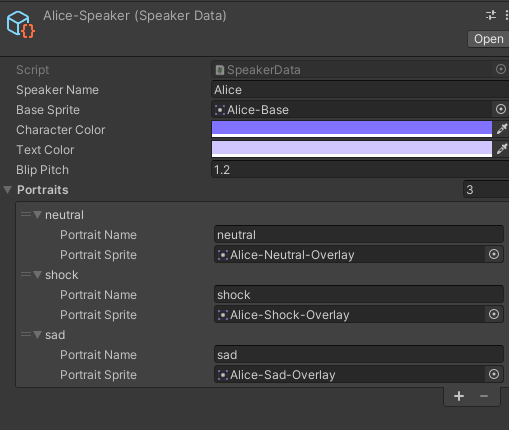
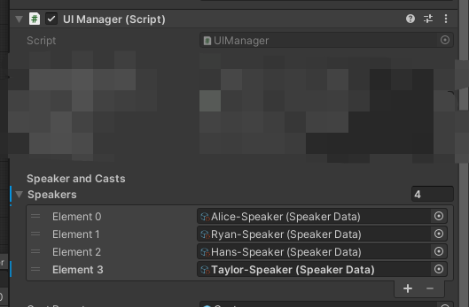

# Dialogue System
## 0. Table of Contents


## 1. Read as You Go: Setup
### 1.1. Adding Files to the Directory: The Basics
The project has a **initial file** that it will load on startup - though you can change that by editing the code found in `Scripts/Managers/ScenarioManager.cs`
```
protected override void Awake()
{
	base.Awake();
	LoadTextAsset("Scripts/Prologue"); //File extension is not needed
}
```

`LoadTextAsset()` will always look for files in the `Resources` folder. It takes one argument - path of the file relative to the `Resources` folder. In the example, it will look for the file `Resources/Scripts/Prologue.txt`

Simply put, make sure to put all files you want to load this way under the `Resources` folder.

### 1.2. Adding Files to the Directory: Try It Yourself

Try create a txt file with the following content:
```
Allyce: Hello, World!
Allyce: If everything goes right, you will see these lines without problem.
```

Rename the file to `MyFirstScript.txt` file, and drag and drop into the folder`Resources/Scripts/`

Once you're done, edit `ScenarioManager.cs` and change the file path to the new file. Remember, the function is looking for a path relative to the `Resources` folder. 

Run the project and see if everything gets displayed to the screen.

[Stuck? Click Here](#41-solution-to-12)

## 2. Adding Dialogues
### 2.1. The Basics
As you remembered in §1.2., dialogues are simply in the format of who said what, or `[Speaker's Name][Colon][What the Speaker Said]`.

`Allyce: Hello, World!` will then, undoubtedly, make Allyce says "Hello, World!"

You can also use shorthands: leave out the speaker's name part. This will continue to let the previous person to speak.
```
Allyce: Hello, World!
      : Good Morning!
```

Allyce will speak "Good Morning!" after saying "Hello, World!"

### 2.2. Adding Portraits
To add in a speaker, you need to create a `SpeakerData` object in the project. This can be done by right clicking on the file browser in unity, and choose `Create > SpeakerData`



- **Speaker Name**: This should match the speaker's name in the dialogue script.
- **Base Sprite** This is the sprite with body attached to it.
- **Character Color**: Controls the color of the back plate in the dialogue window.
- **Text Color**: Controls the color of the text the character speaks by default.
- **Blip Pitch**: Is not currently used, but controls the pitch when the character speaks and you hear a blip sound.
- **Portraits**: This is the sprite with only head. This will be overlaid on top of the base sprite to display emotions.
	- **Portrait Name**: The name of the emotion, we'll get to this in the next section
	- **Portrait Sprite**: The face that will be overlaid on top of the base sprite
Click on the plus button to add in a new one.

When you are done creating, look for the UI Manager in the project scene hierarchy. It should be under MainUI, but places could change. Under Speakers, add in a new row and choose the new speaker you just created. If everything goes right, when you let the speaker speak - the correct portrait and color will be displayed.



### 2.3. Using Emotions
To use a emotion, write this instead:
`[Speaker's Name],[Emotion]:[Speaker's Text]`

For example, `Alice,sad: Ooof.` will display Alice in the sad face. Though, you will need to add the portrait in the speaker data first. If no corresponding emotions could be found, the base sprite will be used and no emotion will be displayed.

## 3. Flow Controls
### 3.1. Jump Markers
Jump markers allow you to jump between dialogues, forward or backward. This comes especially handy when you have logic blocks, which we'll talk about in a bit.

To create a jump marker, you write `@[Jump Marker Name]`
```
alice: hello
@JumpToHere
alice: bye!
```

To jump to a jump marker, write `/jump [Jump Marker Name]`

For example, look at this portion of code below.
```
Alice: 1...
Alice: 2...
Alice: 3...
/jumpto SkipFour
Alice: 4...

@SkipFour
Alice: And 5!
```

As the name of the jump marker suggested, Alice will count up to 3, and skip 4. 

### 3.2. Logic Blocks
Two forms of logic block exists: the regular "if something do something / switch case" logic block, and the await logic block.
But first, lets go over the basics of logical comparison.

#### 3.2.1. Logical Comparison
All values of the game are stored inside the GameStateManager. (src: `Scripts/Manager/GameStateManager.cs`),
one of the table stores float variables, while the other stores string variables.
You can compare them with other float or string value using the comparison operator.

Here are your options
 - **==**: Compares if value A equals to value B.
 - **>, >=, <=, <**: Literal meaning. This only works if you are comparing a float against a float.
 - **!=**: Compares if value A is not equal to value B
 - **"=**: Compares two value as string. Useful when you are comparing two string variables.
 
By default, the comparator will look up values in the float table.
`value_alpha == 0.1 #looks up value in float table`

If you want to compare variables in the string table, then one of the value has to be a string (by adding quotation marks before and after the string), or you should be using a string comparator.
```
your_name == "user" #because "user" is treated as a string, your_name is looked up in the string table.
your_name "= his_name #uses the string comparator, so both values are looked up in the string table
your_name == his_name #treated both as float because there's no way to tell whether it's a string or a float.
```

When the GameStateManager couldn't locate a value, the value will be defaulted to 0, or the empty string literal, based on the type of comparison. A warning will be raised but nothing bad will happen.

#### 3.2.2. If/Switch Logic Block
Both logic blocks are written in the same way, except that the If logic block requires a logical comparison while the switch block does not.

Though, both are written in the same way. We'll explain what that means in the next part.
`[[Logical Comparison / Variable]]([Execution 1])([Execution 2])(...)`

##### 3.2.2.1. If Block
When a logical comparison is found, the line will be treated as an if block. Otherwise, it will be treated as a switch block.

Look at this example:
`[number_of_clicks >= 10](/jumpto ClicksGreaterThan10)(/jumpto ClicksLesserThan10)`

The first part `number_of_clicks >= 10` tells the system that this is an if block. When something is recognized as an if block, if the statement is evaluated to true, codes inside `Execution 1` will be executed, or, in this case, `/jumpto ClicksGreaterThan10`. If the statement is evaluated to false, `Execution 2` or `/jumpto ClicksLesserThan10` will be executed.

##### 3.2.2.1. Switch Block
As for the switch block, simply replace the logical comparison with an variable name. You cannot use a string inside a switch block - sad, but switching numbers somewhat fulfills the task sufficiently.

Look at this example:
`[number_of_clicks](/jumpto ClickedNone)(/jumpto ClickedOnce)(/jumpto ClickedTwice)`

If `number_of_clicks` is equal to 0, the first block (`/jumpto ClickedNone`) is executed. if 1, the second and so on.


Whether it's a switch block or an if block, if the block does not specify what to do when a specific condition is met, the code will simply continue execute the next line. If you have more specific use for switches, consider using multiple if statement instead:
```
[number_of_clicks == 10](/jumpto TenthClick)
[number_of_clicks == 8](/jumpto EighthClick)
/jumpto EverythingElse

@EverythingElse
Alice: You didn't have enough clicks to even start with!

@EighthClick
Alice: Well, i'll say that you... passed the test.

@TenthClick
Alice: Great! You clicked 10 times! That is a new record!
```

Simply put, using a jump statement to catch everything that falls out of the basket.


#### 3.2.3. Await Block

Await block is almost the same as an if block - except that the execution is different. When you await for an condition, everything will be blocked until the condition has been fullfilled. You write the await block like this:
`/await [Condition to Fulfill]`

For example: 
```
Alice: Click on the Block for 10 Times!
/await number_of_clicks >= 10
Alice: Well done!
```

In this example, Alice will cue the player to click on the block for 10 times. Only when the block has been clicked 10 times, Alice will say "Well done!"

### 3.3. Setting a Variable


### 3.4. Presenting Choices to the Player
To present a choice to the player, write in this format:
`?([Choice 1])([Choice 2])([Choice 3])...`

For example:
```
Alice: This is a terrible documentation!
?(Nah it's fine)(Yes, absolutely.)
```

The choices will pop up after Alice says "This is a terrible documentation!", one saying "Nah it's fine", the other saying "Yes, absolutely.". Players will have to pick an option before going any further.

In combination with the switch block, you can let the player go to different branches after picking a choice.

```
?(Nah it's fine)(Yes, absolutely.)
[#choice](/jumpto ContinueWritePoopDocumentation)(/jumpto FixBadDocumentation)
...
```

In the example, `#choice` is a meta value. The value stores the last choice the player has made. 


## 4. All Existing Functions to Call, and Explanations
### 4.1. Solution to §1.2.


## 4. Adding, and Modifying Existing Code:
### 4.1. Solution to §1.2.


## 4. Appendix:
### 4.1. Solution to §1.2.
```
LoadTextAsset("Scripts/MyFirstScript");
```

Remember, `LoadTextAsset()` looks for a path relative to the `Resources` folder. That being said, your path does not need to contain the `Resources` folder. File extension is not required by default.

If you are still stuck, check if files with the same name but different extension is inside the folder.


## 目前已经可以用的
**跳到@开头的对应tag上**

```/jumpto [tag]```

**修改变量的值**

```/setflag [key] [value]```

例如：```/setflag smartphone_1 1```
会把名叫smartphone_1的变量设置为1。

**调用项目里的函数**

```/call [function name]```

函数的内容目前还是需要我们负责。写的时候写个placeholder名字就行，到时候我们在代码这边接上

**等待条件满足**

```/await [condition]```

条件满足后运行下一行。

例如：```/await smartphone_1 == 1```。等```smartphone_1```的数值变为1时，停止等待，运行下一行的内容。

其他的运算符号包括```> >= == <= < != 以及 "= (用于比较两个字符串变量)```

关于字符串变量比较：

带有引号的变量会被当做字符串。只要两个变量中有一个头和尾加上了引号，就会变成字符串之间的变量比较。

例如：```#phone_app_opened == "hello"``` 会将字符串变量```#phone_app_opened```的值和字符串```hello```进行比较。

想要比较两个字符串变量时，用```"=```作为比较符。

字符串变量和数值变量保存在不同的字典里，未避免混淆，请勿建立同一名字的两个字符串和数值变量。

**条件分支**

```[[condition]](when success)(when failure)```

condition可以像上面一样，写比较句，例如

```[smartphone_1 == 1](/jumpto success)(/jumpto failure)```

也可以当做switch来使用，例如

```[#choice](/jumpto choice0)(/jumpto choice1)(/jumpto choice2)```

此时，会根据#choice的值决定运行哪一段内容。```#choice```是保留变量，用来保存玩家上一次做出选择时的选项。选择第一个选项即为0，第二个为1，以此类推。

有多个条件，但是分支数量不足时，例如```[#choice](/jumpto choice0)(/jumpto choice1)```但#choice为2，或```[smartphone_1 == 1](/jumpto success)```得出结果为false，此时会默认执行下一行内容。

**给玩家提供选项**

```?(Choice 1)(Choice 2)(Choice 3)....```

会在屏幕上显示多个选项，选项内容为括号里面的内容。

例如```?(Yes)(No)```

玩家做出的选择会被保存在```#choice```这个保留关键字里。第一个选项为0，第二个为1，以此类推。

一个常用的办法是将选项和分支结合

```
?(Yes)(No)
[#choice](/jumpto yes)(/jumpto no)
```


**调整对话窗口的显示**

```/showui [true/false]```

**载入新文件**

```/load [file]```


载入指定位置的剧本，剧本的名称不需要包括扩展名，用相对于```/Resource/```的路径即可
例如：```/load 2_get_to_meowwer```会载入```Resource```文件夹下的```2_get_to_meowwer.txt```

**禁止玩家关闭手机**

```/alwaysshowphone [true/false]```

设置为```true```时，玩家不可关闭手机。设置后需要手动设置回```false```

**存档/读档**

```/savegame /loadgame```

```/savegame```会将当前的状态保存下来，```/loadgame```会载入最后一次保存的存档。

由于可能形成死循环，尽量将```loadgame```作为选择分支后的动作，只有玩家确认了才能载入。


**淡入淡出**

```/fade [front/back] [in/out] [color]```

```front```指的是淡出的部分在对话框上方
```back```指的是淡出的部分在对话框下方，手机上方。
```color```为16进制颜色，不写默认为黑色

**显示/隐藏对话框中的角色**

```/cast [show/hide] [name]```
例如```/cast show ryan```

## 你不一定知道的

**修改角色表情**

```alice,happy: lorem ipsum```

在角色名称后面加上逗号和表情，可以改变角色表情。
当然，前提是有角色和相关表情的数据存在。

**终止对话**

在文件末尾加上一个```@End```的标签
然后在想要强制终止的地方直接```/jumpto End```即可


执行之后，不管剩下什么内容，一律不会执行。
可能会用到的地方：

```
[#choice](/jumpto choice0)(/jumpto choice1)
@choice0
Alice: you have landed in choice 0
/jumpto @End
@choice1
Alice: you have landed in choice 1
/jumpto @End
```

跳到其中一个分支，Alice说话之后终止。

**玩家在看哪一个APP？**

```
#phone_app_opened -> 可能的值："meowwer", "meowgle", "homescreen"
#phone_view_opened -> 可能的值：依app决定
```

**玩家在看哪一个网页/推特？**

```
#phone_postview_uniqueid -> 可能的值：依推特决定，在推特里设置"uniquePostID"。没有时默认为空字符串
#browser_webpage_uid -> 可能的值：依网页决定，在网页里设置"UniqueID"值即可。没有时默认为空字符串
```


## 还没做的

可以提前写在脚本里，不会影响运行。
你用到了我就开始做相关的功能

**屏幕抖动**

```/shake [magnitude] [frequency]```

**随机变量**

```#random```

暂定每一帧更新一次，变量为```Mathf.Random()```的值（0~1之间）