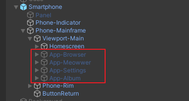

# Dialogue System
## 0. Table of Contents

- [Dialogue System](#dialogue-system)
  * [0. Table of Contents](#0-table-of-contents)
  * [1. Read as You Go: Setup](#1-read-as-you-go--setup)
    + [1.1. Adding Files to the Directory: The Basics](#11-adding-files-to-the-directory--the-basics)
    + [1.2. Adding Files to the Directory: Try It Yourself](#12-adding-files-to-the-directory--try-it-yourself)
  * [2. Adding Dialogues](#2-adding-dialogues)
    + [2.1. The Basics](#21-the-basics)
    + [2.2. Adding Portraits](#22-adding-portraits)
    + [2.3. Using Emotions](#23-using-emotions)
  * [3. Flow Controls](#3-flow-controls)
    + [3.1. Jump Markers](#31-jump-markers)
    + [3.2. Logic Blocks](#32-logic-blocks)
      - [3.2.1. Logical Comparison](#321-logical-comparison)
      - [3.2.2. If/Switch Logic Block](#322-if-switch-logic-block)
        * [3.2.2.1. If Block](#3221-if-block)
        * [3.2.2.2. Switch Block](#3222-switch-block)
      - [3.2.3. Await Block](#323-await-block)
    + [3.3. Setting a Variable](#33-setting-a-variable)
    + [3.4. Presenting Choices to the Player](#34-presenting-choices-to-the-player)
  * [4. Adding, and Modifying Existing Sequence Functions:](#4-adding--and-modifying-existing-sequence-functions-)
  * [5. Appendix:](#5-appendix-)
    + [5.1. All Meta Values](#51-all-meta-values)
    + [5.2. All Existing Functions to Call](#52-all-existing-functions-to-call)
    + [5.3. Solution to §1.2.](#53-solution-to--12)

<small><i><a href='http://ecotrust-canada.github.io/markdown-toc/'>Table of contents generated with markdown-toc</a></i></small>

## 1. Read as You Go: Setup
### 1.1. Adding Files to the Directory: The Basics
The project has a **initial file** that it will load on startup - though you can change that by editing the code found in `Scripts/Managers/ScenarioManager.cs`
```
protected override void Awake()
{
	base.Awake();
	LoadTextAsset("Scripts/Prologue"); //File extension is not needed
}
```

`LoadTextAsset()` will always look for files in the `Resources` folder. It takes one argument - path of the file relative to the `Resources` folder. In the example, it will look for the file `Resources/Scripts/Prologue.txt`

Simply put, make sure to put all files you want to load this way under the `Resources` folder.

### 1.2. Adding Files to the Directory: Try It Yourself

Try create a txt file with the following content:
```
Allyce: Hello, World!
Allyce: If everything goes right, you will see these lines without problem.
```

Rename the file to `MyFirstScript.txt` file, and drag and drop into the folder`Resources/Scripts/`

Once you're done, edit `ScenarioManager.cs` and change the file path to the new file. Remember, the function is looking for a path relative to the `Resources` folder. 

Run the project and see if everything gets displayed to the screen.

[Stuck? Click Here](#53-solution-to-12)

## 2. Adding Dialogues
### 2.1. The Basics
As you remembered in §1.2., dialogues are simply in the format of who said what, or `[Speaker's Name][Colon][What the Speaker Said]`.

`Allyce: Hello, World!` will then, undoubtedly, make Allyce says "Hello, World!"

You can also use shorthands: leave out the speaker's name part. This will continue to let the previous person to speak.
```
Allyce: Hello, World!
      : Good Morning!
```

Allyce will speak "Good Morning!" after saying "Hello, World!"

### 2.2. Adding Portraits
To add in a speaker, you need to create a `SpeakerData` object in the project. This can be done by right clicking on the file browser in unity, and choose `Create > SpeakerData`


- **Speaker Name**: This should match the speaker's name in the dialogue script.
- **Base Sprite** This is the sprite with body attached to it.
- **Character Color**: Controls the color of the back plate in the dialogue window.
- **Text Color**: Controls the color of the text the character speaks by default.
- **Blip Pitch**: Is not currently used, but controls the pitch when the character speaks and you hear a blip sound.
- **Portraits**: This is the sprite with only head. This will be overlaid on top of the base sprite to display emotions.
	- **Portrait Name**: The name of the emotion, we'll get to this in the next section
	- **Portrait Sprite**: The face that will be overlaid on top of the base sprite
Click on the plus button to add in a new one.

When you are done creating, look for the UI Manager in the project scene hierarchy. It should be under MainUI, but places could change. Under Speakers, add in a new row and choose the new speaker you just created. If everything goes right, when you let the speaker speak - the correct portrait and color will be displayed.


### 2.3. Using Emotions
To use a emotion, write this instead:
`[Speaker's Name],[Emotion]:[Speaker's Text]`

For example, `Alice,sad: Ooof.` will display Alice in the sad face. Though, you will need to add the portrait in the speaker data first. If no corresponding emotions could be found, the base sprite will be used and no emotion will be displayed.

## 3. Flow Controls
### 3.1. Jump Markers
Jump markers allow you to jump between dialogues, forward or backward. This comes especially handy when you have logic blocks, which we'll talk about in a bit.

To create a jump marker, you write `@[Jump Marker Name]`
```
alice: hello
@JumpToHere
alice: bye!
```

To jump to a jump marker, write `/JumpTo [Jump Marker Name]`

For example, look at this portion of code below.
```
Alice: 1...
Alice: 2...
Alice: 3...
/JumpTo SkipFour
Alice: 4...

@SkipFour
Alice: And 5!
```

As the name of the jump marker suggested, Alice will count up to 3, and skip 4. 

### 3.2. Logic Blocks
Two forms of logic block exists: the regular "if something do something / switch case" logic block, and the await logic block.
But first, lets go over the basics of logical comparison.

#### 3.2.1. Logical Comparison
All values of the game are stored inside the GameStateManager. (src: `Scripts/Manager/GameStateManager.cs`),
one of the table stores float variables, while the other stores string variables.
You can compare them with other float or string value using the comparison operator.

Here are your options
 - **==**: Compares if value A equals to value B.
 - **>, >=, <=, <**: Literal meaning. This only works if you are comparing a float against a float.
 - **!=**: Compares if value A is not equal to value B
 - **"=**: Compares two value as string. Useful when you are comparing two string variables.
 
By default, the comparator will look up values in the float table.
`value_alpha == 0.1 #looks up value in float table`

If you want to compare variables in the string table, then one of the value has to be a string (by adding quotation marks before and after the string), or you should be using a string comparator.
```
your_name == "user" #because "user" is treated as a string, your_name is looked up in the string table.
your_name "= his_name #uses the string comparator, so both values are looked up in the string table
your_name == his_name #treated both as float because there's no way to tell whether it's a string or a float.
```

When the GameStateManager couldn't locate a value, the value will be defaulted to 0, or the empty string literal, based on the type of comparison. A warning will be raised but nothing bad will happen.

#### 3.2.2. If/Switch Logic Block
Both logic blocks are written in the same way, except that the If logic block requires a logical comparison while the switch block does not.

Though, both are written in the same way. We'll explain what that means in the next part.
`[[Logical Comparison / Variable]]([Execution 1])([Execution 2])(...)`

##### 3.2.2.1. If Block
When a logical comparison is found, the line will be treated as an if block. Otherwise, it will be treated as a switch block.

Look at this example:
`[number_of_clicks >= 10](/JumpTo ClicksGreaterThan10)(/JumpTo ClicksLesserThan10)`

The first part `number_of_clicks >= 10` tells the system that this is an if block. When something is recognized as an if block, if the statement is evaluated to true, codes inside `Execution 1` will be executed, or, in this case, `/JumpTo ClicksGreaterThan10`. If the statement is evaluated to false, `Execution 2` or `/JumpTo ClicksLesserThan10` will be executed.

##### 3.2.2.2. Switch Block
As for the switch block, simply replace the logical comparison with an variable name. You cannot use a string inside a switch block - sad, but switching numbers somewhat fulfills the task sufficiently.

Look at this example:
`[number_of_clicks](/JumpTo ClickedNone)(/JumpTo ClickedOnce)(/JumpTo ClickedTwice)`

If `number_of_clicks` is equal to 0, the first block (`/JumpTo ClickedNone`) is executed. if 1, the second and so on.


Whether it's a switch block or an if block, if the block does not specify what to do when a specific condition is met, the code will simply continue execute the next line. If you have more specific use for switches, consider using multiple if statement instead:
```
[number_of_clicks == 10](/JumpTo TenthClick)
[number_of_clicks == 8](/JumpTo EighthClick)
/JumpTo EverythingElse

@EverythingElse
Alice: You didn't have enough clicks to even start with!

@EighthClick
Alice: Well, i'll say that you... passed the test.

@TenthClick
Alice: Great! You clicked 10 times! That is a new record!
```

Simply put, using a jump statement to catch everything that falls out of the basket.


#### 3.2.3. Await Block

Await block is almost the same as an if block - except that the execution is different. When you await for an condition, everything will be blocked until the condition has been fullfilled. You write the await block like this:
`/Await [Condition to Fulfill]`

For example: 
```
Alice: Click on the Block for 10 Times!
/Await number_of_clicks >= 10
Alice: Well done!
```

In this example, Alice will cue the player to click on the block for 10 times. Only when the block has been clicked 10 times, Alice will say "Well done!"

### 3.3. Setting a Variable
You can set a variable in the following format:
`/SetFlag [Flag Name] [Value / Flag Name]`

For example, 
`/SetFlag character_alpha 0.1` sets the flag `character_alpha` to 0.1

Currently, you can only set float flags. String flags is something so unusual to use that it's probably not needed. If you have interest in adding the functionality, check [Adding, and Modifying Existing Code:](#4-adding-and-modifying-existing-code)

### 3.4. Presenting Choices to the Player
To present a choice to the player, write in this format:
`?([Choice 1])([Choice 2])([Choice 3])...`

For example:
```
Alice: This is a terrible documentation!
?(Nah it's fine)(Yes, absolutely.)
```

The choices will pop up after Alice says "This is a terrible documentation!", one saying "Nah it's fine", the other saying "Yes, absolutely.". Players will have to pick an option before going any further.

In combination with the switch block, you can let the player go to different branches after picking a choice.

```
?(Nah it's fine)(Yes, absolutely.)
[#choice](/JumpTo ContinueWritePoopDocumentation)(/JumpTo FixBadDocumentation)
...
```

In the example, `#choice` is a meta value. The value stores the last choice the player has made. First choice would be 0, second 1, etc.
There are other meta values in the [appendix](#5-appendix). 


## 4. Adding, and Modifying Existing Sequence Functions:
As you can see, some of the sequence lets you call a function using a forward slash `/[FunctionName]`. There's a lot more functions that you can use - if you want to check each one, check in [appendix](#5-appendix). 
However, if you find a certain function not really doing its job, or wanting to add more functions - there's two place you want to check.

If a function is in the form `/Call [FunctionName]`, then the function is inside `Scripts/Manager/SequenceFuncManager.cs`. The functions inside here are probably only called once or twice, and are overly specific to be made into a something you can call with an argument. 

If a function is in the form `/[FunctionName]`, these functions are inside `Scripts/DialogueSystem/TaskRunners/CommandTaskRunner.cs`. These functions are usually called multiple times over in the project, and can have arguments without getting overly specific.

To add a new function, simply mimic how other functions do.

## 5. Appendix:
### 5.1. All Meta Values

Meta values always start with a pound in front to indicate that they are different. 

 - `#choice`: Records the player's last choice. First choice is 0, second is 1, etc.
 - `#random`: a random float between 0.0 and 1.0. Polls every tick.
 - `#phone_app_opened`: a string that returns which app is opened. The value depends on what apps are on the smartphone. Currently, it could be `meowwer`, `meowgle`, `settings`, `album`
 - `#phone_view_opened`: this value is determined by each app. You can find their definitions under each app's settings. The apps can be found in the project hierarchy:


 - `#phone_postview_uniqueid`: this value specifies which meowt post is the user looking at. For specific settings, check the meowt section. When the view is not opened, this value should be empty.
 - `#browser_webpage_uid`: similar to the previous one. This specifies which webpage is the user looking at. When the view is not opened, this value should be empty.
 
### 5.2. All Existing Functions to Call
 - `/JumpTo [JumpMarker]`: Jumps to an existing jump marker 
 - `/SetFlag [Key] [Value]`: Assign `[Value]` to flag named `[Key]`. Only float values can be assigned currently.
 - `/Call [FunctionName]`: Calls a function inside `SequenceFuncManager`. The functions here are overly specific or only used for once or twice.
 - `/Await [Condition]`: Halts here, and when a condition is satisfied, continue executing the next line.
 - `/ShowUI [true/false]`: Show, or hides the dialogue panel. When true, the dialogue panel is up, and only input on the panel is allowed. When false, the panel is retracted and players can interact with the surrounding.
 - `/Load [File Path]`: Loads in a new scenario file. The path is relative to the `Resources/` folder.
 - `/AlwaysShowPhone [true/false]`: whether the player can close their phone or not.
 - `/SaveGame`: Writes the current game status into the save state. There's only one save state available.
 - `/LoadGame`: Loads from the save state. Note that you can create an infinite loop using `/SaveGame` and `/LoadGame`. Try to not let that happen by only loading the game after the player confirms loading.
 - `/Fade [front/back] [in/out] [Color(Optional)]`: Fades the screen in, or out using the color specified. Color takes a hex color code, or any color names, such as `#FFFFFF` or `black`. `Front` means that everything on the screen will be covered, while `back` means that the dialogue panel, the speaker's portrait will not be covered, but everything else will be covered.
 - `/LoadScene [SceneName]`: Loads a new scene of the given scene name. The scene must be [added to Unity's build settings](https://docs.unity3d.com/Manual/BuildSettings.html)
 - `/Cast [show/hide] [Cast Name] [Emote(Optional)]` Force show/hide a cast on screen. When the first argument is `show`, you can specify an emotion to show th cast in.
 - `/SleepFor [Time]` Sleeps for a certain amount of time in seconds, then continue to execute the next line.
 - `/BGM [FileName] [Volume] [Pitch]` Plays a piece of music in the background. You must add the audio resource to the AudioManager found under the scene hierarchy.
 - `/SFX [FileName] [Volume] [Pitch]` Same as above, but does not loop. This is played specifically on a sound effect channel.
 - `/IndexSearch [File Path]` Indexes a search result file in the project. Relative to the Resources folder.
 - `/LoadMeowts [File Path] [Replace Original(Optional)]` Loads in a meowt file in the project. This will allow you to see new meowts in meowwer. Replace Original is defaulted to false. When set to false, it appends new meowts onto the existing meowt data. Otherwise, replaces the original.
 - `/Timeline [Timeline Name]` Plays a specific timeline. Need to be registered with the Timeline Manager in the scene hierarchy. It should be Under "GeneralManager"
 - `/SetNav [true/false]` Whether the player can navigate between pages. When set to false, players will not be able to hit return button, or click on links on the page - they don't do anything.
 
 
 
### 5.3. Solution to §1.2.
```
LoadTextAsset("Scripts/MyFirstScript");
```

Remember, `LoadTextAsset()` looks for a path relative to the `Resources` folder. That being said, your path does not need to contain the `Resources` folder. File extension is not required by default.

If you are still stuck, check if files with the same name but different extension is inside the folder.
