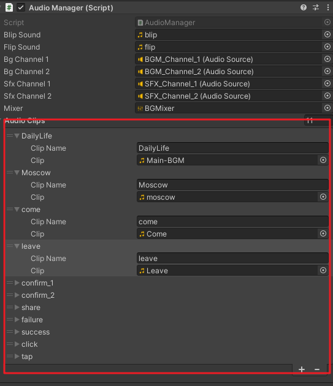
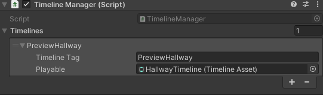

# The Managers
## 0. Table of Contents

## 1. SmartphoneManager
SmartphoneManager is responsible for:
 - Controlling the visibility of the Smartphone
 - Starting an app, or passing data between apps.
 - For more detail on starting apps or making your own apps, [check here](readme_smartphone_system.md)
### 1.1. Relationship to Dialogue Script
 - Whenever an app is opened, the meta value `#phone_app_opened` will be set to the corresponding name of the app.
 - Whenever a app starts its view, the meta value `#phone_view_opened` will be set to the corresponding name of the view.
 - Calling `/AlwaysShowPhone [true/false]` in dialogue script will invoke functions in this manager, and stop or allow players from closing the phone.
 - Calling `/SetNav [true/false]` in dialogue script will invoke functions in this manager to stop or allow players from navigating into other pages.-

### 1.2. Handy Functions in SmartphoneManager
 - `ButtonReturn()`: Simulates a return button press on Android devices. Removes the latest view on queue, and start the new latest view.
 - `StartApp(string appName, string viewID, bool startFresh)`: Starts another app and opens up the view given. If `startFresh`, all apps and views before this will be closed. The newly started view will be the only one on queue. If `startFresh` is set to false, the view is added to the existing queue.
 - `PassData(ViewData data)`: Passes a view data object to the latest view. The latest view's function `PopulateFromViewData()` will pick this up, and populate content based on the data passed.

## 2. MeowwerManager
MeowwerManager is responsible for:
 - Loading Meowts (Tweets in real life) into its meowt base
 - Per request, send Meowts to apps that needs it.
 - For more detail on adding and loading Meowts, [check here](readme_meowt_system.md)

### 2.1. Relationship to Dialogue Script
  - Whenever a Meowt is expanded (view with comments), the meta value `#phone_postview_uniqueid` will be set to the corresponding unique id of the webpage.
  - Calling `/LoadMeowts [File Path] [Replace Original(Optional)]` in dialogue script will cause this manager to call the `AppendMeowts()` function.

### 2.2. Handy Functions in MeowwerManager
 - `AppendMeowts(string path, bool replaceOriginal = false)`: Reads all meowts from a JSON at the given path, relative to the `Resources` folder, and add to the Meowt registry. If `replaceOriginal`, all meowts before will be removed before appending. Otherwise, the meowt is appended to the bottom of the Meowt list.
 - `GetMeowtUserFromUID(string uid)`: Returns a `MeowtUser` object from the given user id string. If no matches are found, returns `null`
 - `ParseJsonFromPath(string path)`: From the given path, parses a JSON file and returns a `MeowtWrapper` object. The wrapper contains a list of `Meowt` objects in the field `meowts`.
 - `GetMeowts(int count)`: returns the first `count` Meowts in the Meowt registry. If `count` is set to 0, returns the full list.

## 3. SearchManager
SearchManager is responsible for:
 - Loading and indexing webpages
 - Parsing the webpage's detail info (SearchResult.txt)
 - Executing a Search Based on the Given Keywords
 - For more detail on search indexes and adding webpages, [check here](readme_search_system.md)

### 3.1. Relationship to Dialogue Script
 - Whenever a webpage is opened, the meta value `#browser_webpage_uid` will be set to the corresponding unique id of the webpage.
 - Calling `/IndexSearch [File Path]` will invoke the `IndexFiles()` function in this manager.

### 3.2. Handy Functions in SearchManager
 - `IndexFiles(string path = "search_index")`: From the given path to a index file, relative to the `Resources` folder, reads in the new search indices, and replace them with the original.
 - `ExtractWebpageContent(string path)`: From the given path to a `SearchResult.txt`, relative to the `Resources` folder, retreive a dictionary of strings that uses anything before the colon as key, and anything after the colon as value.
 - `SearchFor(string searchString)`: Break `searchString` down into words, and search each word separatly for results. Then, returns a list of `QueryResult`: a `string searchResult` with the corresponding webpage name, and an `int searchHeuristic` with how many matches of keywords does this search result has. The list is sorted in order of higher `searchHeuristic` to lower.
 - `SearchFromTextbox(TMP_InputField textInput)`: Does the same as above, but takes a [TextMeshPro](https://learn.unity.com/tutorial/working-with-textmesh-pro) InputField as an argument. Searches with string entered in the InputField.

## 4. ScenarioManager
ScenarioManager is responsible for:
 - Loading another dialogue script and running it
 - For more detail on the dialogue system, [check here](readme_dialogue_system.md)
### 4.1. Relationship to Dialogue Script
 - Calling `/Load [path]` in dialogue script will invoke `LoadTextAsset()` in this manager, and load in a new dialogue.

### 4.2. Handy Functions in ScenarioManager
 - `LoadTextAsset(string path)`: reads a dialogue script in the given `path`, relative to the `Resources` folder, and display it on screen.

## 5. UIManager
UIManager is responsible for:
 - Displaying characters and text on screen
 - Handling choices that the player made
 - For more detail on the dialogue system, [check here](readme_dialogue_system.md)

### 5.1. Relationship to Dialogue Script
 - Calling `/ShowUI [true/false]` will invoke functions in this manager to hide, or show the dialogue panel.
 - Calling `/Cast [show/hide] [Cast Name] [Emote(Optional)]` will invoke functions in this manager to show, or hide characters on screen.
 - Calling `/Fade [front/back] [in/out] [Color(Optional)]` will invoke functions in this manager to fade or fade out panels to cover things up.

## 6. UIMaskManager
UIMaskManager is responsible for:
 - Displaying a mask to cue the player to click into something
 - When a mask is active, players can only click on the item that the mask focuses on.

### 6.1. Handy Functions in ScenarioManager
 - `MaskTo(RectTransform transform, bool silentMask = false)`: Chooses a `RectTransform` and shows a semi transparent mask to it.  Everything else on the scene will be dimmed and become un-clickable. If `transform` is set to `null`, then nothing will be masked and everything will be clickable. If `silentMask` is set to true, then nothing will be dimmed, but only the masked object will be clickable.

## 7. SequenceFuncManager
SequenceFuncManager is responsible for:
 - Storing functions in the dialogue system that are too specific, or simply used too infrequently that it better not be made into a command with arguments

### 7.1. Relationship to Dialogue Script
 - Calling `/call [functionName]` will cause this manager to look up on the registered functions, and execute if the function exists.

### 7.2. Handy Functions in SequenceFuncManager
 - `AddFunction(string funcName, Action functionToRun)`: Adds in a function that can be run with `/call [funcName]` in the dialogue script. `functionToRun` is an anonymous function that will be called when the specific line in the dialogue script runs.

## 8. GameDataManager
GameDataManager is responsible for:
 - Storing game variables and game save states.
 - Comparing game variables

### 8.1. Relationship to Dialogue Script
 - Calling `/SaveGame` or `/LoadGame` in dialogue scripts invokes the `SaveGame()` or `LoadGame()` function in this manager
 - Calling `/SetFlag [Key] [Value]` will invoke the `SetFlag()` function in this manager.
 - When using a [logic block](readme_dialogue_system.md#32-logic-blocks) in dialogue script, GameDataManager is responsible to performing the comparison.

### 8.2.  Handy Functions in GameDataManager
 - `SaveGame() / LoadGame()`: Saves the game into a GameSaveState object. Currently, the project only has one GameSaveState object, meaning that if you call `SaveGame()` twice, the new data will override the old data. Calling `LoadGame()` loads the latest GameSaveState.
 - `GetFlag() / SetFlag(string flagName, float value)`: Sets a float flag to the manager.
 - `GetStringFlag() / SetStringFlag(string flagName, string value)`: Sets a string flag to the manager. String flags and float flags are stored in different tables.

## 9. AudioManager
AudioManager is responsible for:
 - Playing sound effects
 - Playing a music track looping in the background

### 9.1. Relationship to Dialogue Script
 - Calling `/sfx [clip]` or `/bgm [clip]` in dialogue scripts invokes the `PlaySFX()` and `PlayBGM()` function in this manager.

### 9.2.  Handy Functions in GameDataManager
 - `PlayBGM(string clipName, float volume = 1.0f, float pitch = 1.0f)`: Plays a background music with the given clipname. Clip must be assigned to the AudioManager in advance. `volume` is a float ranging from `0.0f` to `1.0f`. `1.0f` for `pitch` is the base pitch. Increase or decrease it to play higher or lower pitch. If this is called while another track is playing, it fades out the other track and fades in the new track.
 - `PlaySFX(string clipName, float volume = 1.0f, float pitch = 1.0f)`: Plays a sound effect. Settings are same as above, except that the clip will only play once.

## 10.0. TimelineManager
TimelineManager is responsible for:
 - Playing a timeline.
 - Though, this manager is used rarely currently.

### 10.1. Relationship to Dialogue Script
 - Calling `/Timeline [timeline]` will play a timeline on screen.
 - Requires assigning the timeline to this manager first, similar to assigning audios to the audio manager.

